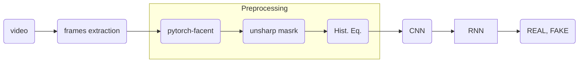

# DeepFake detection

research about deepfake detection

## Model

```mermaid
graph LR
    A(video) --> B(frames extraction)
    B --> C
    subgraph Preprocessing
    C(pytorch-facent) --> D(unsharp masrk)
    D -->E(Hist. Eq.)
    end

    E --> CNN(CNN)
    CNN --> RNN
    RNN --> GOAL(REAL, FAKE)
```

## Usage

## Streamlit App
