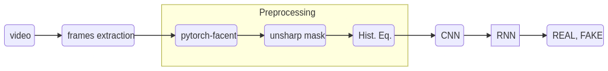

# DeepFake detection

research about deepfake detection

## Data

https://www.kaggle.com/c/deepfake-detection-challenge/data

## Model



## Install Environment

install with pip

```
python3 -m venv venv
source venv/bin/activate
pip install -r requirements.txt
```

or with poetry:

```
python3 -m venv venv
source venv/bin/activate
poetry install
```

## Usage

```
usage: main.py [-h] [--path DATA_PATH] [--epochs EPOCHS] [--no-cache] [--fit-and-score] [--cv] [--cnn {resnet18,resnet34}] 
[--export-path EXPORT_PATH] [--export] [--no-preprocessing]

optional arguments:
  -h, --help            show this help message and exit
  --path DATA_PATH, -p DATA_PATH
  --epochs EPOCHS, -e EPOCHS
                        Number of epochs
  --no-cache            not using data prom previous run
  --fit-and-score       fit model and compute train score
  --cv                  run cross validation
  --cnn {resnet18,resnet34}
                        Set used cnn
  --export-path EXPORT_PATH
                        filename where to save model
  --export              set to save trained model
  --no-preprocessing    not using preprocessing pipeline
```

Example:

fit and score model from `path/to/data` using 20 epochs

```
python main.py --fit-and-score -p path/to/data -e 2 
```

## Streamlit App

streamlit app was creating for testing:
```
pip install streamlit
streamlit run streamlitapp.py
```
